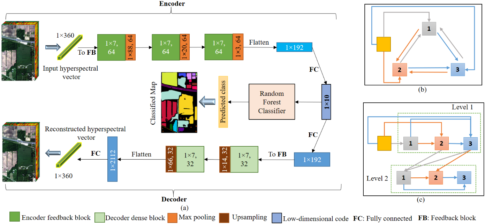

# Feedback-convolution-based-autoencoder-for-dimensionality-reduction-in-hyperspectral-images

Hyperspectral images (HSI) possess a very high spectral resolution (due to innumerous bands), which makes them invaluable in the remote sensing community for landuse/land cover classification. However, the multitude of bands forces the algorithms to consume more data for better performance. To tackle this, techniques from deep learning are often explored, most prominently convolutional neural networks (CNN) based autoencoders. However, one of the main limitations of conventional CNNs is that they only have forward connections. This prevents them to generate robust representations since the information from later layers is not used to refine the earlier layers. Therefore, we introduce a 1D-convolutional autoencoder based on feedback connections for hyperspectral dimensionality reduction. Feedback connections create self-updating loops within the network, which enable it to use future information to refine past layers. Hence, the low dimensional code has more refined information for efficient classification. The performance of our method is evaluated on Indian pines 2010 and Indian pines 1992 HSI datasets, where it surpasses the existing approaches.



# URL to the paper: 
>[Paper](https://ieeexplore.ieee.org/stamp/stamp.jsp?arnumber=9883594)

# Requirement:

```
Tensorflow 2
```
# Steps:

```
1. Download the dataset from the provided URL in data folder
```
```
2. Run data_prepare.py
```
```
3. Run model_fbae.py
```
# Citation

If using the concept or code, kindly cite the paper as: 
>S. Pande, B. Banerjee. Feedback Convolution Based Autoencoder for Dimensionality Reduction in Hyperspectral Images. IEEE International Geoscience and Remote Sensing Symposium (IGARSS), July, 2022.

You can also use the bibtex as:
```
@inproceedings{pande2022feedback,
  title={Feedback Convolution Based Autoencoder for Dimensionality Reduction in Hyperspectral Images},
  author={Pande, Shivam and Banerjee, Biplab},
  booktitle={IGARSS 2022-2022 IEEE International Geoscience and Remote Sensing Symposium},
  pages={147--150},
  year={2022},
  organization={IEEE}
}
```
